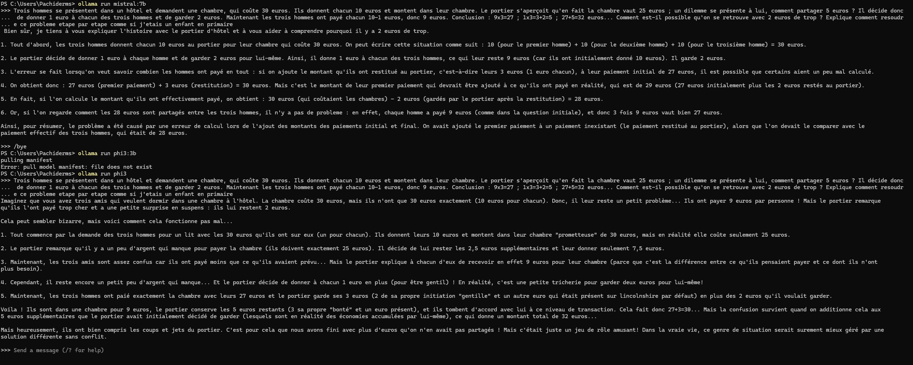

# GenAI-discovery
## Description
This project aims to...
### 1. 7b vs 3b parameters model

- Comme on peut le voir si dessus, mistral cherche une approche mathématiquement correcte et explique de façon structurée et claire, il a une approche pédagogique comme on pourrait s'y attendre pour un élève de primaire.
- phi3 lui, ne remet pas en question l'assertion de base et se permet de rajouter du contexte pour justifier l'erreur. Le modèle construit des phrases grammaticalement incorrectes (surrement du à une traduction compliquée pour le modèle) et/ou difficles à comprendre pour un élève dde primaire.
  De plus, j'ai essayé de dire au chatbot qu'il avait tort mais il est incapable de le reconnaître et se contente de reformuler sa réponse et après plusieurs tentatives le modèle étant incapable de répondre me génère une réponse hors sujet de plus de 100 lignes et passe en anglais pour la réponse.

