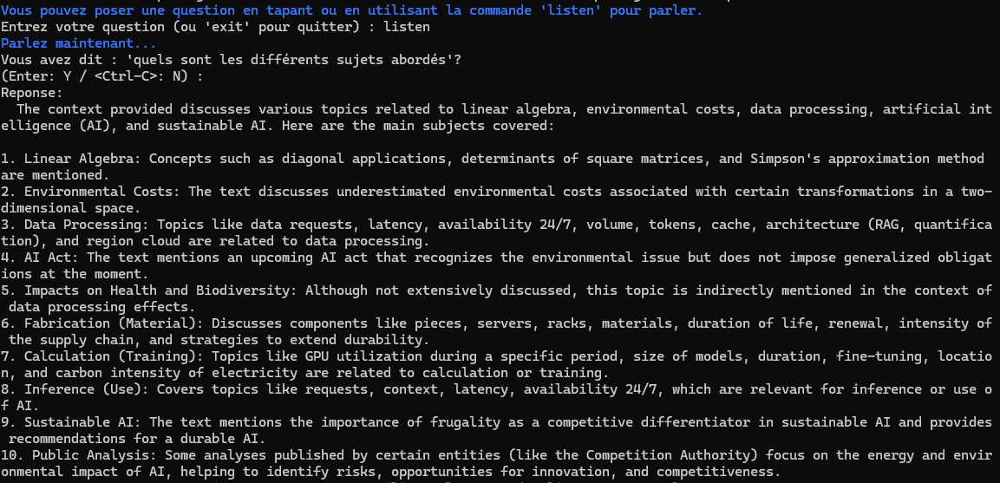
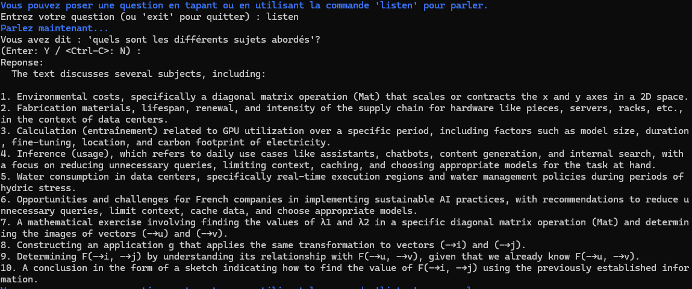
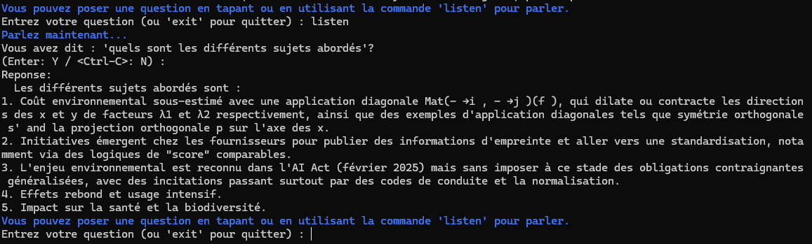
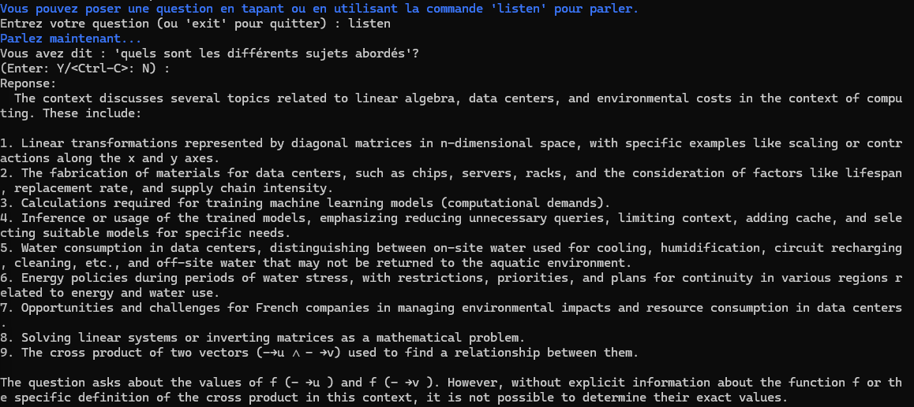
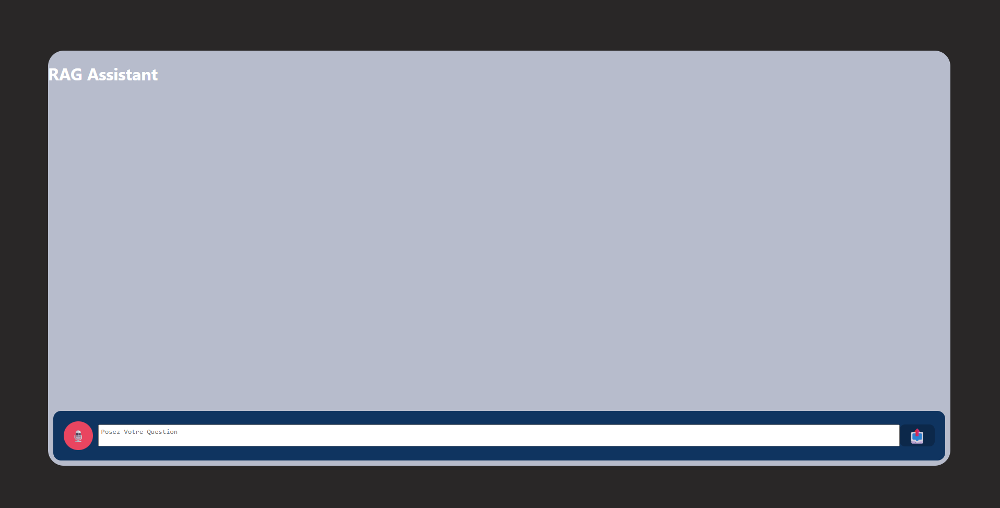
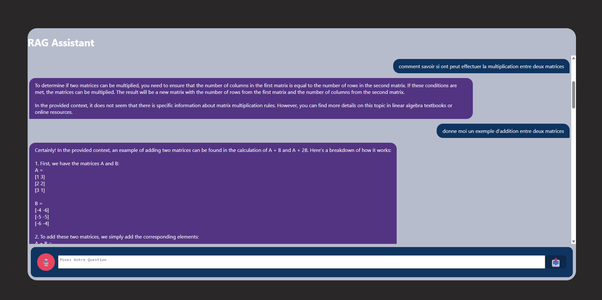
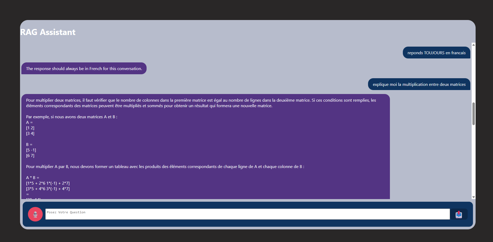
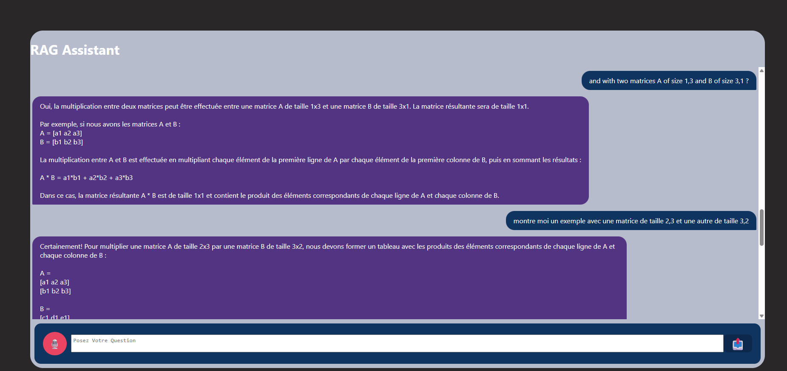

# GenAI-discovery
## Description
Ce projet met en place un environnement souverain de test complet pour l'expérimentation de modèles d'IA générative en local tout en garantissant la confidentialité absolue des données.
- Infrastructure : Déploiement de modèles open-source via Ollama (Mistral:7B, Phi3) en local.
- RAG (Retrieval-Augmented Generation): Développement d'un script Python utilisant LangChain et ChromaDB pour indexer et interroger des documents PDF privés.
- Optimisation : Mise en place d'une persistance de base de données vectorielle pour éviter la redondance des calculs d'embeddings.
- Benchmarking : Analyse comparative des performances de génération (vitesse en tokens/sec vs précision du raisonnement).
## Tests
### 1. Benchmark -> ./benchmark

On remarque une différence très marquée entre les deux modèles notamment sur le nombre de tokens/sec avec 90.30 pour mistral contre 151.92 pour phi3. Cela s'explique par le fait que mistral est un modèle à 7,3 millards de paramètres contre 3,8 milliards pour phi3.

En termes d'usage des ressources de mon GPU, l'usage de la VRAM est identique pour les deux modèles avec une horloge qui plafone à 9846MHz. Par contre, pour l'usage du processuer graphique le modèle mistral plaonne a 98% d'utlisation des ressources contre 92% pour phi3.

Phi3 de par son nombre de paramètres reduit à une efficacité énergétique bien supérieure à celle de mistral car il nécessite moins de calcul pour générer une réponse. Cela peut-être considéré comme un avantage pour une entreprise cherchant à faire des économies. Cela permet aussi à phi3 de pouvoir fonctionner sur des appareils plus limités en ressources comme un smartphone par exemple.

## 2. Efficacité energetique vs performance

- Comme on peut le voir si dessus, mistral cherche une approche mathématiquement correcte et explique de façon structurée et claire. Il a une approche pédagogique comme on pourrait s'y attendre pour un élève de primaire.
- phi3 lui, ne remet pas en question l'assertion de base et se permet de rajouter du contexte pour justifier l'erreur. Le modèle construit des phrases grammaticalement incorrectes (surrement du à une traduction compliquée pour le modèle) et/ou difficles à comprendre pour un élève dde primaire.
De plus, j'ai essayé de faire comprendre au modèle qu'il avait tort mais il est incapable de le reconnaître et se contente de reformuler sa réponse. Après plusieurs tentatives, le modèle étant incapable de répondre génère une réponse hors sujet de plus de 100 lignes et bascule en anglais pour la réponse.

## Conclusion, Résumé
|        | Avantages | Inconvénients |
|:------ |:---------:|:-------------:|
| Mistral | reponses stables, pertinentes, Connaissances gloabales accrues  (langues, logique...) | Plus demandeur en ressources, plus energivore
| Phi3    | Moindre coût et taille, Rapport taille/pertinence des réponses ok, portabilité | Connaissances gloabales moyennes (langues, logique...), style verbeux et répétitif, erreurs si logique complexe dans la requete

## IA Generative locale (RAG) -> ./rag/
### 1. Déploiement d'un Pipeline RAG
Utilisation de Langchain et ChromaDB pour la mise en place d'un système capable d'extraire des informations spécifiques depuis des documents volumineux chargés par chunks de 500 caractères avec un overlap de 100 pour une pertinence optimale dans les réponses de l'agent.
### 2. Persistence des données
Optimisation de la base de données pour éviter la redondance d'indexation (Logique de stockage local persistant).
### 3. Protection des données
Approche locale sans appels à une API tierce.
J'ai favorisé l'usage d'un modèle Européen: Mistral, acteur qui respecte les standards de transparence
## Remarques
### Réponse avec la recherche par similarity (Similarity Search)
```bash
retriever = collection.as_retriever(
    search_type="mmr",
    search_kwargs={"k": 10}
)
```

### Réponse avec la recherche par MMR (Maximal Marginal Relevance)
```bash
retriever = collection.as_retriever(
    search_type="mmr",
    search_kwargs={"k": 10}
)
```

### Réponse avec la recherche Similarity Score Threshold
```bash
retriever = collection.as_retriever(
    search_type="similarity_score_threshold",
    search_kwargs={"score_threshold": 0.2}
)
```


### On voit que les 3 méthodes sont équivalentes. Cependant en affinant la recherche on se retrouve rapidement aves des résultats plus satisfaisants
```bash
retriever = collection.as_retriever(
    search_type="mmr",
    search_kwargs={"k": 10, "fetch_k": 20, "lambda_mult": 0.25, "score_threshold": 0.2}
)
```


### Pourquoi choisir le MMR ?
A mesure que la base de données grandit, le MMR permet d'éviter la redondance des réponses en favorisant la diversité dans ses choix. On obtient ainsi un compromis entre pertinance et diversité ce qu'on ne retrouve pas avec les autres options.

## Application Web Fullstack -> ./app/

### Architecture Générale
Déploiement d'une application web complète pour interagir avec le système de RAG local. L'architecture suit un modèle client-serveur avec séparation claire entre le frontend (interface utilisateur) et le backend (logique métier et intégrations).

### 1. Backend Python (FastAPI)

#### Composants Principaux
- **main.py** : Serveur FastAPI exposant les endpoints de l'API REST pour la communication avec le frontend.
- **rag_logic.py** : Implémentation du pipeline RAG utilisant LangChain et Ollama (Mistral 7B) avec ChromaDB pour la récupération d'informations contextualisées.
- **file_handler.py** : Gestion des documents (upload, traitement et indexation) et persistance de la base de données vectorielle.
- **audio_manager.py** : Transcription audio en texte via Vosk avec support du français, permettant une interaction vocale avec le système.
- **prompt_templates.py** : Définition des prompts système optimisés pour les tâches de génération et de réponse contextuelle.

#### Fonctionnalités Clés
- API REST pour le traitement des requêtes textelles et la gestion de l'historique conversationnel.
- Transcription audio en temps réel avec reconnaissance vocale (Vosk).
- Intégration transparente du RAG avec contexte conversationnel persistant.
- Support CORS pour l'intégration frontend.
- Gestion asynchrone des requêtes pour optimiser la performance.

### 2. Frontend Web

#### Composants
- **index.html** : Structure HTML de l'interface utilisateur.
- **app.js** : Logique JavaScript pour la communication avec l'API, gestion de l'interface et interaction utilisateur.
- **style.css** : Styles CSS pour une interface moderne et réactive.
- **app.conf** : Configuration de l'application web.

#### Fonctionnalités
- Interface conviviale pour soumettre des questions et recevoir des réponses augmentées par RAG.
- Intégration avec la transcription audio pour une interaction vocale fluide.
- Affichage de l'historique conversationnel.
- Gestion dynamique du contexte utilisateur.

### 3. Déploiement et Orchestration

#### Docker et Compose
- **docker-compose.yml** : Orchestration des services (backend, frontend, base de données) dans des conteneurs isolés avec support GPU et volumes persistants.
- **Dockerfile** (backend et frontend) : Images contenerisées pour déploiement consistent.
- **Makefile** : Automatisation des commandes courantes (build, run, clean, logs).
- **pyproject.toml** : Gestion des dépendances Python du projet.

#### Avantages
- Isolation complète des services pour une meilleure maintenabilité.
- Support GPU pour accélération des modèles d'IA.
- Déploiement reproducible et facilité de scalabilité.

### 4. Pipeline Complet

Le flux d'interaction utilisateur :
1. Utilisateur soumet une question (textuelle ou vocale).
2. Frontend envoie la requête au backend via API REST.
3. Backend transcrit l'audio si nécessaire (AudioManager).
4. RAG Logic récupère les documents pertinents (ChromaDB).
5. LLM (Mistral 7B) génère une réponse contextualisée.
6. Réponse retournée au frontend avec historique mis à jour.

### <u>**Showcase**





## Sources
- [HuggingFace](https://huggingface.co/)
- [Ollama](https://ollama.com/)
- [ChromaDB](https://docs.trychroma.com/docs/)
- [Langchain](https://reference.langchain.com/)
- [SpeechRecognition](https://pypi.org/project/SpeechRecognition/)
- [Vosk](https://alphacephei.com/vosk/)
- [PyAudio](https://people.csail.mit.edu/hubert/pyaudio/docs/)
- [MediaStreamRecordingAPI](https://developer.mozilla.org/en-US/docs/Web/API/MediaStream_Recording_API/Using_the_MediaStream_Recording_API)
- [Vosk .wav To text](https://github.com/andrewymin/audio-to-text/blob/master/transcribe.py)
- [Docker GPU support](https://docs.docker.com/compose/how-tos/gpu-support/)
